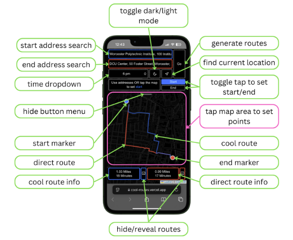
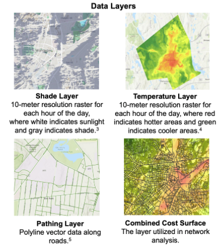

# Worcester, MA Cool Route App
This is a Major Qualifying Project (MQP) For WPI.  

The purpose is to provide cool, thermally comfortable walking paths that prioritize shade and low temperatures, and direct routes between two user provided points at a given time.  

Access the app [here](https://cool-routes.vercel.app).  
Access a full report and visual for this project [here](https://digital.wpi.edu/concern/student_works/8k71nn47d)

## Tech Stack
The app uses Javascript, React and Next.js for the front-end and Python, Arcpy, and Flask for the back-end.  

## Front-end
Features can be found in the diagram below.
The base map was configured with Leaflet and the map graphic was provided by CartoDB.

  

To use the app, a start point and end point must be placed either by tapping the map or selecting an address. With permission, the users current location can be used to set the starting point. A time must also be selected, defualting to the devices current time. Once the required information is filled, the 'Go' button can be pressed that will generate both the cool (blue) and direct (red) routes and show them on the map.  

## Back-end
This is where the routes are generated. The API requires start and end coordinates and a time. The time determines the accumulated cost dataset to use and traverse through and the coordinates are the basis for the route finding functions. Currently, the API server is run off a pc that uses Ngrok to for forwarding, but the ArcGIS license has been terminated in concurrence with the end of the academic year and ther server is no longer active. To reactivate, the license must be restored or an alterior method must be used for the route calculation.

## Data
The data used is air temperature, shade, and a network representing traversable pathways. There is a unique dataset for each hour between 6am and 8pm based on an average summer day.

